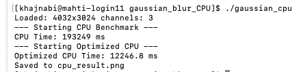

# CPU Gaussian Blur Benchmark (C++)

This project implements and benchmarks **Gaussian blur on the CPU** using two approaches:

1. **Naive 2D convolution** with a full Gaussian kernel
2. **Separable Gaussian blur** (horizontal + vertical passes) for optimization comparison

The goal is to **measure performance differences** between a straightforward implementation and a mathematically optimized version.

## Features

* Loads an image using `stb_image`
* Applies Gaussian blur on all color channels
* Benchmarks execution time using `std::chrono`
* Writes the output image as PNG
* Handles image borders via clamping

## Implementations

* **`cpuGaussianBlur`**
  Full 2D convolution with a generated Gaussian kernel (O(r²) per pixel)

* **`cpuGaussianSeparable`**
  Optimized separable Gaussian blur using two 1D passes (O(r) per pixel)


## Output

* Prints image metadata and timing results to stdout
* Saves the blurred image as:

  ```
  cpu_result.png
  ```

## Notes

* Kernel radius: `10`
* Sigma: `5.0`
* The separable version is algorithmically faster but still CPU-bound and not vectorized

## Dependencies

* `stb_image.h`
* `stb_image_write.h`

Both are header-only and included directly.

## Input


## Output


## Execution Time


